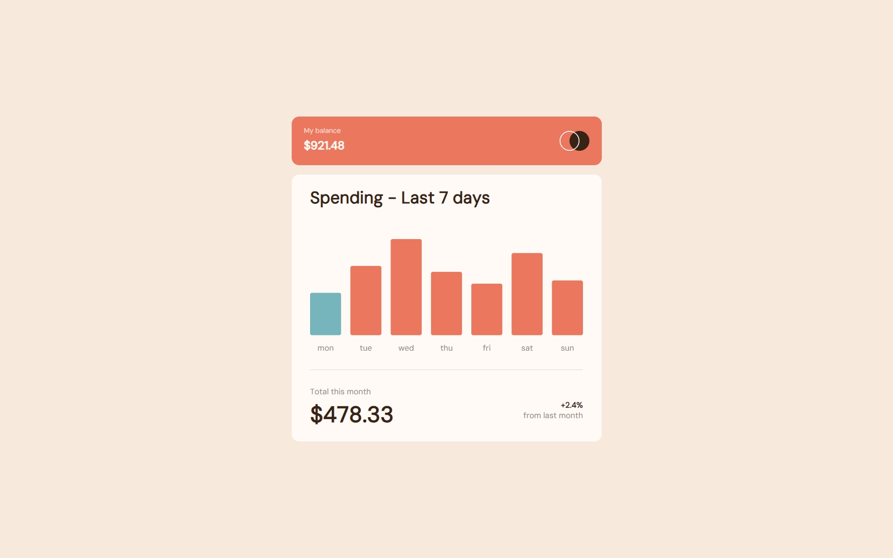
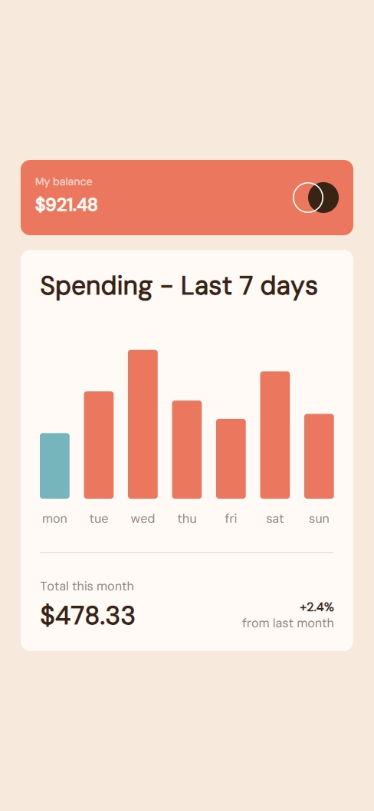

# Frontend Mentor - Expenses chart component solution using D3

This is a solution to the [Expenses chart component challenge on Frontend Mentor](https://www.frontendmentor.io/challenges/expenses-chart-component-e7yJBUdjwt). Frontend Mentor challenges help you improve your coding skills by building realistic projects.

## Table of contents

- [Frontend Mentor - Expenses chart component solution using D3](#frontend-mentor---expenses-chart-component-solution-using-d3)
  - [Table of contents](#table-of-contents)
  - [Overview](#overview)
    - [The challenge](#the-challenge)
    - [Screenshot](#screenshot)
    - [Links](#links)
  - [My process](#my-process)
    - [Built with](#built-with)
    - [What I learned](#what-i-learned)
  - [Author](#author)

**Note: Delete this note and update the table of contents based on what sections you keep.**

## Overview

### The challenge

Users should be able to:

- View the bar chart and hover over the individual bars to see the correct amounts for each day
- See the current day’s bar highlighted in a different colour to the other bars
- View the optimal layout for the content depending on their device’s screen size
- See hover states for all interactive elements on the page
- **Bonus**: Use the JSON data file provided to dynamically size the bars on the chart

### Screenshot

|                   Desktop                   |                  Mobile                   |
| :-----------------------------------------: | :---------------------------------------: |
|  |  |

### Links

- Solution URL: [Add solution URL here](https://github.com/Atatra/expenses-chart-d3)
- Live Site URL: [Add live site URL here](https://expenses-chart-d3.vercel.app/)

## My process

### Built with

- [D3.js](https://d3js.org/) - Data visualization library
- Semantic HTML5 markup
- CSS custom properties
- Flexbox
- Mobile-first workflow

### What I learned

Thanks to this challenge, I had the opportunity to test D3.js for data visualization. The data is processed and rendered dynamically inside an `<svg>` element. I learnt how to use d3's linear scaling to fit each `<rect>` inside the `<svg>` correctly.

- Scaler

```js
const yScale = d3
  .scaleLinear()
  .domain([0, d3.max(dataset, (d) => d.amount)])
  .range([padding, h - padding]);
```

- Plot each bar based on input data

```js
d3.select("svg")
  .selectAll("rect")
  .data(dataset)
  .enter()
  .append("rect")
  .attr("class", (d, i) => {
    if (i === getDay()) return "barToday";
    return "bar";
  })
  .attr("width", rectW)
  .attr("height", (d) => {
    console.log(d.day, yScale(d.amount));
    return yScale(d.amount);
  })
  .attr("x", (d, i) => i * (rectW + gap))
  .attr("y", (d) => h - (yScale(d.amount) + padding))
  .attr("rx", roundedCorner)
  .attr("ry", roundedCorner);
```

## Author

- Frontend Mentor - [@Atatra](https://www.frontendmentor.io/profile/Atatra)
